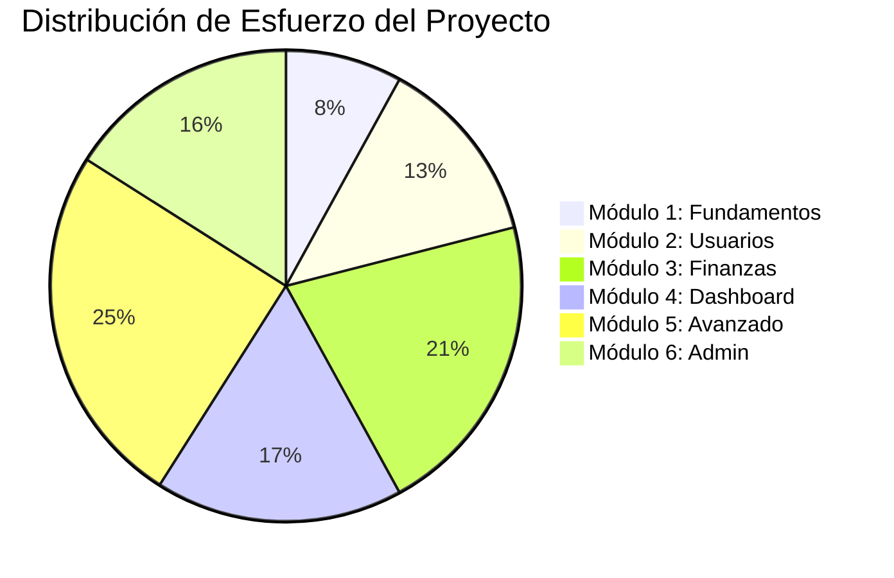

# MiBolsillo
Plataforma web responsive para gestionar tus finanzas personales, ingresos, gastos y metas.

# 💸 Plataforma Web para Gestión de Finanzas Personales
Esta es una aplicación web responsive, gratuita y desplegada en Vercel, diseñada para gestionar tus finanzas personales de forma intuitiva y visual. Compatible con escritorio y dispositivos móviles, la plataforma permite llevar el control mensual de tus ingresos, gastos y avances financieros, todo vinculado a tu cuenta de Google.

## 🚀 Roadmap de Desarrollo Modular
Este proyecto se desarrolla siguiendo una metodología de Andamiaje Cognitivo, dividiendo el trabajo en módulos incrementales. A continuación se detalla cada fase, su complejidad, participación en el proyecto y el cronograma estimado.

**Tiempo Total Estimado:** 12 semanas

---

### 🧱 Módulo 1: Fundamentos y Configuración Inicial
**Complejidad:** Baja 🟢

**Participación en el Proyecto:** 8%

**Tiempo Estimado:** 1 Semana

**Objetivo:** Establecer las bases del proyecto, configurar el entorno de desarrollo y el despliegue continuo.

| Tarea | Descripción | Estado |
| :--- | :--- | :---: |
| **Inicialización del Proyecto** | Crear el repositorio y la estructura inicial con `create-next-app`. | ☐ |
| **Configuración de Estilos** | Integrar y configurar Tailwind CSS para un enfoque Mobile First. | ☐ |
| **Estructura de Carpetas** | Definir y crear la arquitectura de directorios base (`components`, `pages`, `lib`, etc.). | ☐ |
| **Despliegue Inicial** | Conectar el repositorio a Vercel para habilitar el CI/CD desde el primer día. | ☐ |
| **Layout Básico** | Crear el componente `Layout` principal, incluyendo `Navbar` y `Footer` placeholders. | ☐ |

---

### 👤 Módulo 2: Autenticación y Gestión de Usuarios
**Complejidad:** Media-Baja 🟡

**Participación en el Proyecto:** 13%

**Tiempo Estimado:** 1.5 Semanas

**Objetivo:** Permitir que los usuarios se registren y gestionen su perfil utilizando su cuenta de Google.

| Tarea | Descripción | Estado |
| :--- | :--- | :---: |
| **Integración de NextAuth.js** | Instalar y configurar NextAuth.js (Auth.js v5). | ☐ |
| **Proveedor Google OAuth** | Crear las credenciales en Google Cloud Console y configurar el proveedor. | ☐ |
| **Flujo de Autenticación** | Implementar las páginas y lógica para Login, Logout y protección de rutas. | ☐ |
| **Modelo de Usuario en DB** | Definir el esquema del usuario en Firestore y crear el registro automático. | ☐ |
| **Página de Perfil** | Crear la UI para que el usuario pueda ver y editar su nombre, cargo y año de inicio. | ☐ |

---

### 💰 Módulo 3: Lógica de Negocio y Finanzas
**Complejidad:** Media 🟠

**Participación en el Proyecto:** 21%

**Tiempo Estimado:** 2.5 Semanas

**Objetivo:** Implementar el núcleo de la aplicación: el registro de transacciones y la billetera virtual.

| Tarea | Descripción | Estado |
| :--- | :--- | :---: |
| **Modelado de Datos** | Implementar la estructura de datos de finanzas en Firestore. | ☐ |
| **Formularios de Registro** | Crear componentes de React para registrar sueldo, ingresos adicionales y gastos. | ☐ |
| **Operaciones CRUD** | Desarrollar Server Actions para crear, leer y actualizar registros financieros. | ☐ |
| **Lógica de la Wallet** | Implementar la lógica que actualiza el saldo de la billetera en tiempo real. | ☐ |
| **Aislamiento de Datos** | Asegurar que cada usuario solo pueda ver y modificar sus propios datos. | ☐ |

---

### 📊 Módulo 4: Dashboard y Visualizaciones
**Complejidad:** Media 🟠

**Participación en el Proyecto:** 17%

**Tiempo Estimado:** 2 Semanas

**Objetivo:** Presentar los datos financieros de forma clara y visualmente atractiva.

| Tarea | Descripción | Estado |
| :--- | :--- | :---: |
| **Diseño del Dashboard** | Maquetar la página principal del dashboard con Tailwind CSS. | ☐ |
| **Integración de Gráficos** | Instalar y configurar Recharts para las visualizaciones. | ☐ |
| **Componentes de Gráficos** | Crear componentes reutilizables para los gráficos de líneas y de tarta. | ☐ |
| **Procesamiento de Datos**| Escribir la lógica para consultar y transformar los datos al formato de Recharts. | ☐ |
| **Pestaña de Avances** | Desarrollar la sección que muestra estadísticas acumuladas y progreso. | ☐ |

---

### 🧠 Módulo 5: Funcionalidades Avanzadas
**Complejidad:** Alta 🔴

**Participación en el Proyecto:** 25%

**Tiempo Estimado:** 3 Semanas

**Objetivo:** Añadir características inteligentes que aporten un valor diferencial a la aplicación.

| Tarea | Descripción | Estado |
| :--- | :--- | :---: |
| **Integración IA Coach** | Conectar con una API de IA (p. ej., Gemini) para generar tips financieros. | ☐ |
| **Recordatorios Inteligentes**| Configurar Cron Jobs en Vercel para notificaciones programadas. | ☐ |
| **Lógica de Alertas** | Implementar la lógica que detecta condiciones (ej. gasto > ingreso) para enviar alertas.| ☐ |
| **Modo Simulación** | Desarrollar la UI y la lógica del front-end para proyectar escenarios financieros. | ☐ |

---

### 🗃️ Módulo 6: Administración y Optimización
**Complejidad:** Media 🟠

**Participación en el Proyecto:** 16%

**Tiempo Estimado:** 2 Semanas

**Objetivo:** Dar al usuario control sobre sus datos y optimizar la aplicación para un mejor rendimiento y alcance.

| Tarea | Descripción | Estado |
| :--- | :--- | :---: |
| **Panel de Configuración** | Crear la página de ajustes del usuario. | ☐ |
| **Exportación de Datos** | Implementar la funcionalidad para exportar datos a CSV. | ☐ |
| **Eliminación de Cuenta** | Crear una Cloud Function para eliminar de forma segura todos los datos de un usuario.| ☐ |
| **Soporte Multimoneda** | Refactorizar la lógica para almacenar y mostrar valores en diferentes monedas. | ☐ |
| **Optimización (SEO/PWA)**| Añadir metadatos para SEO y configurar el manifiesto para PWA. | ☐ |

---

### ⚙️ Stack Tecnológico y Versiones
* **Framework:** Next.js v14.2.x (con App Router)
* **Lenguaje:** TypeScript
* **Estilos:** Tailwind CSS v3.4.x
* **Autenticación:** NextAuth.js (Auth.js) v5.0.0-beta
* **Base de Datos:** Firebase Firestore v10.12.x
* **Hosting:** Vercel
* **Visualizaciones:** Recharts v2.12.x

---

### 📈 Distribución de Esfuerzo por Módulo

  ---

## 🙌 Autor

**CamiloTechCore**  
Desarrollador|Analista de datos 
